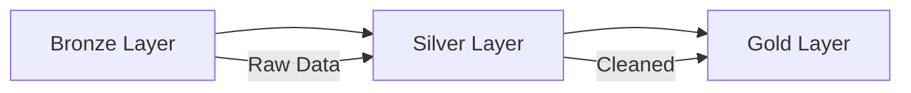

# V1 Improvements - Round 2

## Status: ✅ Implementation In Progress

---

## Issues & Features Overview

| # | Type | Title | Priority | Status |
|---|------|-------|----------|--------|
| 1 | Issue | Prompt formatting - better delimiters | P1 | ✅ **DONE** |
| 2 | Issue | Markdown rendering broken in Streamlit | P0 | ✅ **DONE** |
| 3 | Feature | Mermaid/diagram rendering for architecture questions | P2 | ✅ **DONE** |
| 4 | Feature | Improved markdown rendering in Streamlit | P0 | ✅ **DONE** |
| 5 | Feature | Streaming for LLM call #2 | P0 | ✅ **DONE** |
| 6 | Feature | Unified LangSmith tracing | P3 | ✅ **DONE** |
| 7 | Feature | Easy topic addition (scalability) | P0 | ✅ **DONE** |
| 8 | Feature | Expand to 13 topics | P3 | 🔜 Backlog (complex) |

### Implementation Summary

**✅ Completed:**
1. **Topic Scalability** - Created `config/topics.py` as single source of truth
   - `TopicConfig` dataclass with name, display_name, csv_file, keywords, description
   - Helper functions: `get_topic_names()`, `get_topic_definitions_for_prompt()`, `match_topic()`
   - Updated `settings.py`, `models.py`, `chat_v0.py`, `app_v0.py` to use it
   - Adding new topic now requires: 1) Add CSV, 2) Add TopicConfig entry, 3) Run ingestion

2. **Streaming** - Added `answer_stream()` method to ChatService
   - Preprocessing still synchronous (~1s)
   - LLM response streams token-by-token
   - Shows typing indicator (▌) while streaming

3. **Markdown Post-processing** - Created `utils/text_processing.py`
   - `post_process_markdown()` ensures proper `\n\n` for paragraph breaks
   - Fixes headers, code blocks, lists rendering in Streamlit
   - Applied in `app_v0.py` after streaming completes

4. **LangSmith Tracing** - Added `@traceable` decorators for observability
   - `services/chat_v0.py`: `answer()`, `answer_stream()`, `_preprocess_query()` decorated
   - `services/retrieval.py`: `retrieve()` decorated
   - Enable with `LANGCHAIN_TRACING_V2=true` + `LANGCHAIN_API_KEY` in `.env`

---

# Issue 1: Prompt Formatting

## Problem
Current prompt template has weak section delimiters:

```
KNOWLEDGE BASE CONTEXT:
{context}

CONVERSATION HISTORY:
{history}

USER QUESTION: {question}
```

This can cause LLM confusion when content bleeds between sections.

## Research: Best Practices for Prompt Delimiters

**Option A: XML-style tags** (Anthropic recommended)
```xml
<context>
{context}
</context>

<conversation_history>
{history}
</conversation_history>

<user_question>
{question}
</user_question>
```

**Option B: Markdown headers with separators**
```markdown
### KNOWLEDGE BASE CONTEXT ###
{context}

---

### CONVERSATION HISTORY ###
{history}

---

### USER QUESTION ###
{question}
```

**Option C: Triple backticks (code block style)**
```
KNOWLEDGE BASE CONTEXT:
```
{context}
```

CONVERSATION HISTORY:
```
{history}
```
```

## Recommendation
**Option A (XML tags)** - Best for structured data separation
- Claude/Nova models handle XML well
- Clear start/end boundaries
- No ambiguity

## Open Questions
- [ ] Does Amazon Nova Lite handle XML tags well? (Need to test)

---

# Issue 2: Markdown Rendering Broken

## Problem
LLM output with proper markdown formatting renders as inline text in Streamlit.

**LLM Output (correct):**
```markdown
🟢 **Basic Level:**

1. **Q: Explain the difference between lists and tuples in Python.**
   📚 **Definition:** Lists are mutable...
   💡 **Use Case:** Use lists for collections...
```

**Streamlit Render (broken):**
```
🟢 Basic Level: Q: Explain the difference... 📚 Definition: Lists are mutable... 💡 Use Case: Use lists...
```

## Root Cause Analysis

Looking at the current code in `app_v0.py`:
```python
def render_chat_messages() -> None:
    for message in st.session_state.messages:
        with st.chat_message(message["role"]):
            st.markdown(message["content"])
```

**Potential causes:**
1. LLM returns `\n` but markdown needs `\n\n` for paragraph breaks
2. Streamlit's `st.markdown()` has issues with certain patterns
3. The content is being modified somewhere before display

## Research Findings

**Streamlit markdown quirks:**
- Single `\n` is treated as soft break (same line)
- Need `\n\n` for paragraph breaks OR use `<br>` with `unsafe_allow_html=True`
- Nested lists need proper indentation (4 spaces)

## Proposed Solutions

**Solution A: Post-process LLM output**
```python
def fix_markdown_newlines(content: str) -> str:
    # Ensure double newlines for paragraph breaks
    # Add line breaks after specific patterns
    content = re.sub(r'(\*\*[^*]+\*\*:)', r'\1\n', content)
    return content
```

**Solution B: Use HTML rendering**
```python
import markdown
html_content = markdown.markdown(response.content)
st.markdown(html_content, unsafe_allow_html=True)
```

**Solution C: Instruct LLM to use HTML breaks**
Add to system prompt: "Use `<br>` for line breaks within formatted sections"

## Recommendation
Start with **Solution A** (post-processing) - least invasive

## Open Questions
- [ ] Is the issue in LLM output or Streamlit rendering?
- [ ] Does `st.write()` behave differently than `st.markdown()`?

---

# Feature 1: Mermaid Diagram Rendering

## Use Case
For architecture/system design questions, render diagrams:

**Example:**
```
User: "Explain the medallion architecture"

LLM Response includes:

```

## Research Findings

**Available Options:**

1. **streamlit-mermaid** (v0.3.0 available)
   ```python
   import streamlit_mermaid as stmd
   stmd.st_mermaid(mermaid_code)
   ```
   - ✅ Simple to use
   - ✅ Already available in PyPI
   - ⚠️ Need to extract mermaid blocks from LLM response

2. **st.components.v1.html with mermaid.js**
   ```python
   import streamlit.components.v1 as components
   
   mermaid_html = f"""
   <script src="https://cdn.jsdelivr.net/npm/mermaid/dist/mermaid.min.js"></script>
   <div class="mermaid">{mermaid_code}</div>
   """
   components.html(mermaid_html, height=400)
   ```
   - ✅ More control
   - ⚠️ More complex setup

## Implementation Plan

1. **Detect mermaid blocks** in LLM response
   ```python
   import re
   
   def extract_mermaid_blocks(content: str) -> list[tuple[str, str]]:
       """Extract mermaid blocks and their positions."""
       pattern = r'```mermaid\n(.*?)```'
       matches = re.findall(pattern, content, re.DOTALL)
       return matches
   ```

2. **Render mixed content** (markdown + mermaid)
   ```python
   def render_response(content: str):
       # Split content by mermaid blocks
       parts = re.split(r'```mermaid\n.*?```', content, flags=re.DOTALL)
       mermaid_blocks = extract_mermaid_blocks(content)
       
       for i, part in enumerate(parts):
           st.markdown(part)
           if i < len(mermaid_blocks):
               stmd.st_mermaid(mermaid_blocks[i])
   ```

3. **Add to system prompt**
   ```
   For architecture or system design questions, include a Mermaid diagram:
   ```mermaid
   graph TD
       A[Component] --> B[Component]
   ```
   ```

## Recommendation
Use **streamlit-mermaid** for simplicity. Install and test first.

## Open Questions
- [ ] Does LLM reliably generate valid mermaid syntax?
- [ ] How to handle mermaid errors gracefully?

---

# Feature 2: Improved Markdown Rendering

## Ties To
- Issue 2 (broken markdown)
- Feature 1 (mermaid)

## Research: Streamlit Rendering Options

**Current Approach:**
```python
st.markdown(content)  # Basic markdown
```

**Enhanced Options:**

1. **st.markdown with unsafe_allow_html**
   ```python
   st.markdown(content, unsafe_allow_html=True)
   ```
   - Allows `<br>`, `<div>`, custom CSS
   - Security consideration: need to sanitize LLM output

2. **Convert to HTML first**
   ```python
   import markdown
   html = markdown.markdown(content, extensions=['fenced_code', 'tables'])
   st.markdown(html, unsafe_allow_html=True)
   ```

3. **Custom CSS for chat messages**
   ```python
   st.markdown("""
   <style>
   .stChatMessage p { margin-bottom: 1em; }
   .stChatMessage li { margin-bottom: 0.5em; }
   </style>
   """, unsafe_allow_html=True)
   ```

## Recommendation
Combine approaches:
1. Add custom CSS for better spacing
2. Post-process LLM output to fix newlines
3. Use markdown library for HTML conversion as fallback

---

# Feature 3: Streaming for LLM Call #2

## Current State
```python
# In chat_v0.py - answer() method
chain = self._qa_prompt | self.llm | self._parser
response = chain.invoke({...})  # Blocks until complete
```

## Research: LangChain Streaming

**LangChain supports streaming via `.stream()` method:**
```python
# Instead of .invoke()
for chunk in chain.stream({...}):
    yield chunk
```

**With ChatPromptTemplate:**
```python
chain = self._qa_prompt | self.llm | self._parser

# Streaming
for chunk in chain.stream({"context": ctx, "history": hist, "question": q}):
    print(chunk, end="", flush=True)
```

## Research: Streamlit Streaming

**Streamlit has built-in streaming support:**
```python
# Option 1: st.write_stream (simplest)
def generate_response():
    for chunk in chain.stream({...}):
        yield chunk

with st.chat_message("assistant"):
    response = st.write_stream(generate_response())

# Option 2: Manual with placeholder
with st.chat_message("assistant"):
    placeholder = st.empty()
    full_response = ""
    for chunk in chain.stream({...}):
        full_response += chunk
        placeholder.markdown(full_response + "▌")
    placeholder.markdown(full_response)
```

## Implementation Plan

**Step 1: Add streaming method to ChatService**
```python
def answer_stream(
    self,
    message: str,
    history: List[Dict],
) -> Generator[str, None, RAGResponse]:
    """Streaming version of answer()."""
    # Step 1: Preprocess (non-streaming, fast)
    preprocessed = self._preprocess_query(message, history)
    
    # Step 2: Retrieve (non-streaming)
    topic = Topic.from_string(preprocessed.topic) if preprocessed.topic else None
    results = self.retrieval.retrieve(preprocessed.standalone_query, topic)
    
    # Step 3: Generate (STREAMING)
    context = self.retrieval.format_context(results)
    history_text = self._format_history_for_generation(history)
    
    chain = self._qa_prompt | self.llm | self._parser
    
    full_response = ""
    for chunk in chain.stream({
        "context": context,
        "history": history_text,
        "question": preprocessed.standalone_query,
    }):
        full_response += chunk
        yield chunk
    
    # Return final RAGResponse for storage
    return RAGResponse(content=full_response, sources=results, topic=topic)
```

**Step 2: Update app_v0.py**
```python
def handle_message(user_input: str) -> None:
    chat_service = get_chat_service()
    history = get_history()
    
    with st.chat_message("assistant"):
        response_placeholder = st.empty()
        full_response = ""
        
        for chunk in chat_service.answer_stream(user_input, history):
            full_response += chunk
            response_placeholder.markdown(full_response + "▌")
        
        response_placeholder.markdown(full_response)
    
    add_message("assistant", full_response)
```

## Benefits
- **Time to first token**: ~1-2 seconds instead of 5-10 seconds
- **Better UX**: User sees response building
- **Perceived performance**: Feels faster even if total time is same

## Recommendation
**High priority** - significant UX improvement with moderate effort

---

# Feature 4: Unified LangSmith Tracing

## Current State
- LLM call #1 (preprocessing) - separate trace
- LLM call #2 (generation) - separate trace
- Retrieval - not traced at all

## Problem
Can't see full request lifecycle in LangSmith. Hard to debug end-to-end.

## Research: LangSmith Tracing

**Using `@traceable` decorator:**
```python
from langsmith import traceable

@traceable(name="answer_question")
def answer(self, message: str, history: List[Dict]) -> RAGResponse:
    # All nested calls will be grouped under this trace
    preprocessed = self._preprocess_query(message, history)  # Child span
    results = self.retrieval.retrieve(...)  # Child span
    response = chain.invoke(...)  # Child span
    return response
```

**Using `with_config` for run names:**
```python
chain.invoke({...}, config={"run_name": "generate_answer"})
```

**Tracing retrieval:**
```python
from langsmith import traceable

@traceable(name="vector_retrieval")
def retrieve(self, query: str, topic: Optional[Topic] = None):
    # This will appear as a span in LangSmith
    ...
```

## Implementation Plan

1. Add `langsmith` to dependencies (if not already)
2. Decorate main `answer()` method with `@traceable`
3. Decorate `retrieve()` method with `@traceable`
4. Add run names to LLM calls

## Open Questions
- [ ] Is LangSmith already configured in the project?
- [ ] What's the current tracing setup?

---

# Feature 5: Easy Topic Addition (Scalability)

## Current State
Topics are hardcoded in **10+ places**:

| File | Location | Content |
|------|----------|---------|
| `config/settings.py` | `AVAILABLE_TOPICS` | `["Python", "SQL", "Database", "ETL"]` |
| `config/settings.py` | `csv_files` dict | Mapping to CSV files |
| `core/models.py` | `Topic` enum | `PYTHON, SQL, DATABASE, ETL` |
| `services/chat_v0.py` | Preprocessing prompt | Topic definitions |
| `services/chat_v0.py` | Classification rules | Topic boundaries |
| `app_v0.py` | Welcome message | Topic list display |
| Multiple other files | Various references | Hardcoded topic names |

## Problem
Adding a new topic (e.g., "Spark" or "Airflow") requires changes in 10+ places.

## Proposed Architecture

**Single Source of Truth:**
```python
# config/topics.py

from dataclasses import dataclass
from typing import List

@dataclass
class TopicConfig:
    name: str                    # "Python"
    display_name: str            # "🐍 Python"
    csv_file: str               # "DE docs - Python.csv"
    keywords: List[str]         # ["pandas", "list comprehensions", "decorators"]
    description: str            # "Core Python, data wrangling, PySpark"

TOPICS = [
    TopicConfig(
        name="Python",
        display_name="🐍 Python",
        csv_file="DE docs - Python.csv",
        keywords=["pandas", "list comprehensions", "decorators", "PySpark"],
        description="Core Python syntax, pandas, NumPy, APIs, data wrangling, PySpark basics",
    ),
    TopicConfig(
        name="SQL",
        display_name="💾 SQL",
        csv_file="DE docs - SQL.csv",
        keywords=["joins", "window functions", "GROUP BY", "CTE", "subquery"],
        description="Query syntax, joins, window functions, CTEs, subqueries, optimization",
    ),
    # ... more topics
]

def get_topic_names() -> List[str]:
    return [t.name for t in TOPICS]

def get_topic_display_string() -> str:
    return " | ".join([t.display_name for t in TOPICS])

def get_classification_rules() -> str:
    rules = []
    for t in TOPICS:
        keywords = '", "'.join(t.keywords)
        rules.append(f'- "{keywords}" → {t.name}')
    return "\n".join(rules)

def get_topic_definitions() -> str:
    return "\n".join([f"- {t.name}: {t.description}" for t in TOPICS])
```

**Usage:**
```python
# In prompts
from config.topics import get_topic_definitions, get_classification_rules

PREPROCESSING_PROMPT = f"""
TOPIC DEFINITIONS:
{get_topic_definitions()}

CLASSIFICATION RULES:
{get_classification_rules()}
...
"""
```

## Adding a New Topic
With this architecture, adding "Spark":

1. Add CSV file: `DE docs - Spark.csv`
2. Add config to `TOPICS` list:
   ```python
   TopicConfig(
       name="Spark",
       display_name="⚡ Spark",
       csv_file="DE docs - Spark.csv",
       keywords=["RDD", "DataFrame", "SparkSQL", "partition"],
       description="Apache Spark, RDDs, DataFrames, SparkSQL, distributed processing",
   ),
   ```
3. Run ingestion: `python main.py init --force`
4. Done! All prompts and UI automatically updated.

## Recommendation
**Medium priority** - important for maintainability but not urgent

---

# Implementation Priority

## Round 2 Implementation Order

| Priority | Item | Effort | Impact |
|----------|------|--------|--------|
| P0 | Feature 3: Streaming | Medium | High (UX) |
| P0 | Issue 2: Markdown fix | Low | High (UX) |
| P1 | Issue 1: Prompt delimiters | Low | Medium (Quality) |
| P1 | Feature 2: Better rendering | Medium | Medium (UX) |
| P2 | Feature 1: Mermaid diagrams | Medium | Medium (Feature) |
| P2 | Feature 5: Topic scalability | Medium | Medium (Maintainability) |
| P3 | Feature 4: LangSmith tracing | Low | Low (Dev only) |

---

# ✅ Decisions Made (Feb 5, 2026)

## 1. Streaming
**Decision**: Skip loading indicator for preprocessing (~1s)
- Preprocessing is fast enough that showing a spinner would be overkill
- Just stream the final LLM response directly

## 2. Mermaid Diagrams
**Decision**: Let LLM decide when diagrams make sense
- For architecture questions, incline towards generating diagrams
- But LLM should use judgment - not every architecture Q needs a diagram
- Add to system prompt: "For architecture/system design questions, consider including a Mermaid diagram if it would help visualize the concept"

## 3. Topics - **CRITICAL FINDING** 🚨
**EDA Results from master competency sheet:**

| Current Topics (4) | Missing Topics (9) |
|---|---|
| ✅ Database | ❌ Data Pipeline Orchestration |
| ✅ SQL | ❌ Batch and Stream Processing |
| ✅ Python | ❌ Distributed Engines |
| ✅ ETL and Data Warehousing | ❌ Data Extraction |
| | ❌ Data Quality and Governance |
| | ❌ Containerization & CI/CD for Data Pipelines |
| | ❌ Cloud Knowledge for Data Engineers |
| | ❌ Gen AI and AI Agents for Data Pipelines |
| | ❌ Visualization / Reporting |

**Stats:**
- Total competency areas: **13 topics**
- Currently implemented: **4 topics (31%)**
- Missing: **9 topics (69%)**
- Total subtopics in master sheet: **306**

**Decision**: **Scalability is HIGH PRIORITY**
- We need to add 9 more topics!
- Current hardcoded approach won't scale
- Implement `TopicConfig` architecture before adding more topics

## 4. Markdown Rendering
**Decision**: Use **post-processing** approach
- Tested both CSS and post-processing in `experiments/markdown_test.py`
- Post-processing is more reliable across Streamlit versions
- Use regex to ensure proper `\n\n` for paragraph breaks

```python
def post_process_markdown(text: str) -> str:
    """Fix markdown formatting for Streamlit rendering."""
    import re
    
    # Ensure blank line before headers
    text = re.sub(r'([^\n])\n(#{1,6}\s)', r'\1\n\n\2', text)
    # Ensure blank line after headers
    text = re.sub(r'(#{1,6}\s[^\n]+)\n([^\n#])', r'\1\n\n\2', text)
    # Ensure blank line before code blocks
    text = re.sub(r'([^\n])\n(```)', r'\1\n\n\2', text)
    # Ensure blank line after code blocks
    text = re.sub(r'(```)\n([^\n`])', r'\1\n\n\2', text)
    # Ensure blank line before lists
    text = re.sub(r'([^\n\-\d])\n([\-\*]\s|\d+\.\s)', r'\1\n\n\2', text)
    # Clean up triple+ newlines
    text = re.sub(r'\n{3,}', '\n\n', text)
    
    return text
```

---

# 📋 Updated Implementation Priority

| Priority | Item | Effort | Status |
|----------|------|--------|--------|
| **P0** | Feature 5: Topic scalability (`TopicConfig`) | Medium | ✅ Done |
| **P0** | Feature 3: Streaming | Medium | ✅ Done |
| **P0** | Issue 2: Markdown post-processing | Low | ✅ Done |
| **P1** | Issue 1: XML-style prompt delimiters | Low | ✅ Done |
| **P2** | Feature 1: Mermaid diagrams | Medium | ✅ Done |
| P3 | Feature 4: LangSmith tracing | Low | Backlog |
| P3 | Feature 8: Expand to 13 topics | High | Backlog (complex) |

---

# Feature 8: Expand to 13 Topics (BACKLOG)

## Problem Statement
The master competency sheet has **13 topics** but we only have **4 implemented**.

**Current:** Python, SQL, Database, ETL
**Missing:** Orchestration, Streaming, Distributed, Extraction, DataQuality, CICD, Cloud, GenAI, Visualization

## Complexity Analysis (Feb 5, 2026)

### Token Impact: ✅ NOT a problem
- 4 topics: ~166 tokens in prompt
- 13 topics: ~187 tokens in prompt
- Increase: ~21 tokens per request (negligible)

### Real Concerns: 🔴 Topic Overlap

With 13 topics, many questions span multiple topics:

| Example Question | Possible Topics |
|-----------------|-----------------|
| "Explain Spark partitioning" | Distributed? ETL? Python (PySpark)? |
| "Airflow DAG for ETL" | Orchestration? ETL? |
| "Kafka in streaming pipeline" | Streaming? ETL? |
| "dbt tests for data quality" | DataQuality? ETL? CICD? |

### Options to Explore

1. **Consolidate topics** (~8 instead of 13)
   - Merge: Orchestration + Streaming + Distributed → "Data Processing"
   - Merge: Extraction + DataQuality → "Data Ops"
   
2. **Multi-label classification**
   - Allow `topic: ["ETL", "Orchestration"]` instead of single topic
   
3. **Hierarchical classification**
   - Level 1: Core (Python/SQL/DB) vs Pipeline vs Infra
   - Level 2: Specific topic
   
4. **Remove topic filtering entirely**
   - Trust semantic search / embeddings
   - Topic was for precision, but might not be needed

5. **Just try 13 and see what happens**
   - Quick experiment before over-engineering

## Decision
**BACKLOG** - Revisit after completing P1/P2 items. Need more thought on the right approach.

---

*Last Updated: 2026-02-05*
*Status: ✅ P0-P2 complete, only P3 backlog items remain*
